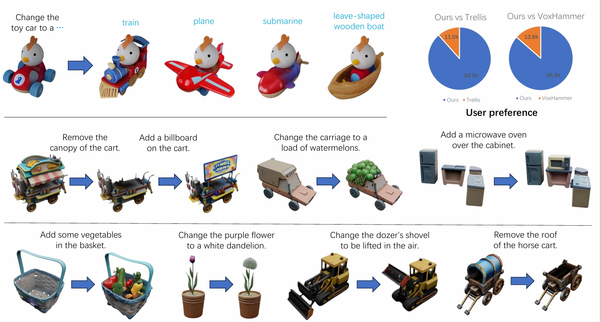

# Vinedresser3D: Towards Agentic Text-guided 3D Editing

[Project Page](https://vinedresser3d.github.io/)



## Installation

1. Create the environment of [Trellis](https://github.com/Microsoft/TRELLIS) and name it as ```vinedresser3d```.

2. Install the following additional packages.
```
pip install lightning yacs boto3 h5py mesh2sdf tetgen==0.6.3 pymeshlab google-genai
pip install torch-scatter -f https://data.pyg.org/whl/torch-2.5.0+cu124.html
```

## Pretrained PartField
Download the pretrained PartField model from [here](https://huggingface.co/mikaelaangel/partfield-ckpt/blob/main/model_objaverse.ckpt) and place it under ```PartField/model/```.

## Usage

1. Place your original asset's file under ```data/``` directory (e.g. glb, obj).

2. Run the following command while replacing ```{ORIGINAL_ASSET_FILE}``` with the name of the original asset's file and ```{EDITING_PROMPT}``` with the editing prompt.
```
python main.py --input_file "{ORIGINAL_ASSET_FILE}" --editing_prompt "{EDITING_PROMPT}"

# Example
python main.py --input_file "ancientFighter.glb" --editing_prompt "Change the sword to an axe."
```

3. The edited SLAT is saved in ```outputs/slat/``` as ```NAME_edited_feats.pt``` and ```NAME_edited_coords.pt```. The preview video is in ```outputs/videos/```.

## Citation

```
@article{chi2026vinedresser3d,
      title={Vinedresser3D: Agentic Text-guided 3D Editing}, 
      author={Yankuan Chi and Xiang Li and Zixuan Huang and James M. Rehg},
      year={2026},
      eprint={2602.19542},
      archivePrefix={arXiv},
      primaryClass={cs.CV},
      url={https://arxiv.org/abs/2602.19542}, 
}
```